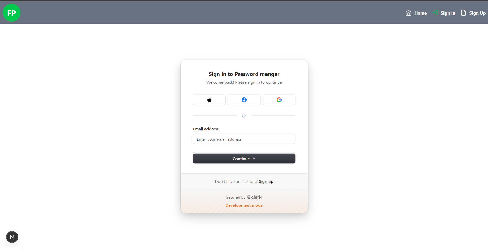
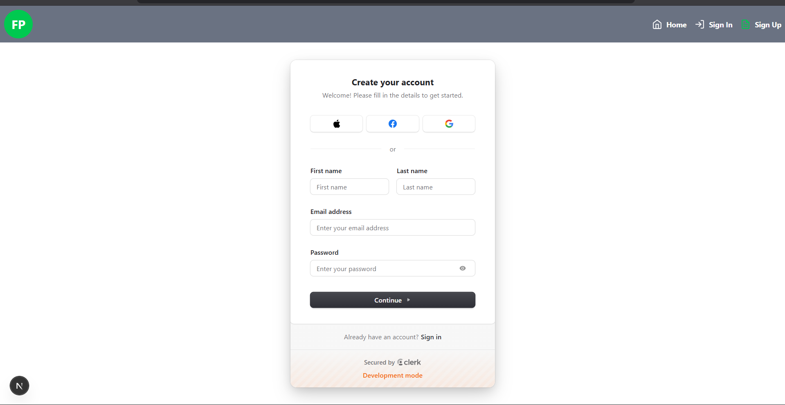
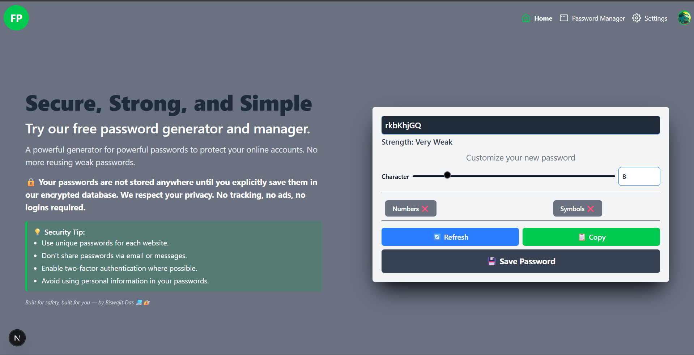
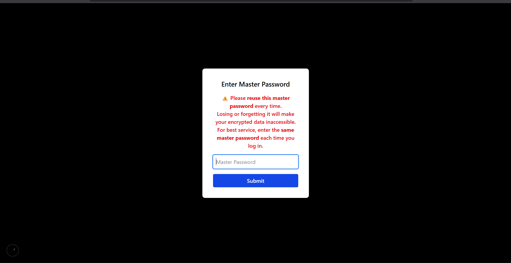
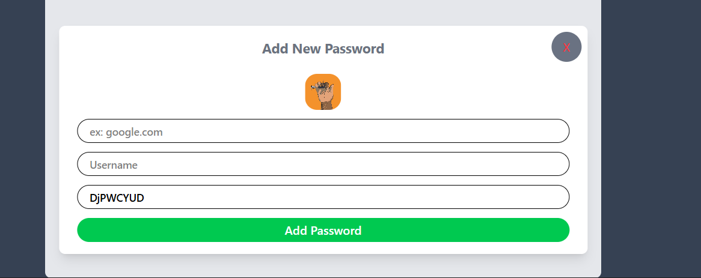
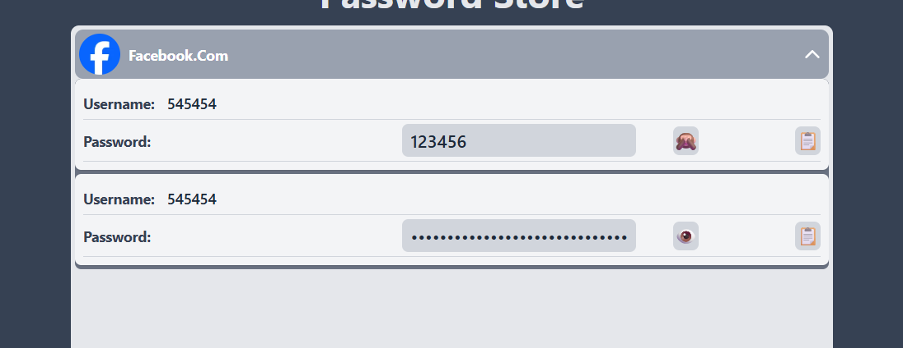

# 🚀 ZeroLock 🔒

ZeroLock is an **open-source Password Generator & Manager** for all devices, built with **Next.js**, **Tailwind CSS**, and **MongoDB**.
It’s designed to be **simple, secure, and accessible** — whether you’re on desktop or mobile.

## 💡 Why ZeroLock?

* ✅ **Easy to Use** – Generate and store passwords in just a few clicks.
* 📂 **Easy to Manage** – Organize your credentials effortlessly.
* 🔐 **Highly Secure** – Uses **Zero-Knowledge Cryptography**, meaning **even the developer (me) can’t access your data**.
🌍 Deployed on [ZeroKey](https://bpm-xi.vercel.app/)
---

## 📚 Table of Contents

* [About](#about)
* [Features](#features)
* [Tech Stack](#tech-stack)
* [Installation](#Installation)
* [Usage](#usage)

---

## 📖 About

ZeroLock is designed to help you securely **store and manage your passwords** in one place.
The idea came from my own struggle — I had multiple accounts with countless passwords, and most existing password managers in the market were **too expensive**.
So, I decided to build my own, open-source, and completely free password manager.

With ZeroLock:

* 🔐 All your passwords are stored securely using **Zero-Knowledge Cryptography**.
* 🗝 You only need to remember **one master password** to encrypt and decrypt all your saved credentials.

---

## ✨ Features

* ➕ Add credentials.
* 🔑 Generate passwords.
* 📝 Edit and delete credentials *(coming soon)*.
* ⚡ Add passwords with a single click.

---

## 🛠 Tech Stack


---

## ⚙️ Installation

1. Clone the repository:

   ```bash
   git https://github.com/Biswajit0972/Free-password-manger.git
   ```
2. Navigate to the project folder:

   ```bash
   cd projectname
   ```
3. Install dependencies:

   ```bash
   npm install
   ```
4. Run the development server:

   ```bash
   npm run dev
   ```
5. Open in your browser:

   ```
   http://localhost:3000
   ```

---

## 🚀 Usage

### Generate a Password Without Login


---

### Store Passwords Securely

1. **Login** using your credentials.
   You can log in using email/password or social accounts like Apple, Facebook, and Google.
   

2. **Sign Up** if you don’t have an account.
   

3. **Store your passwords** in a secure vault.
   

4. **Open the Password Manager dashboard**.
   

> ⚠️ **Warning**
> Please **do not share your credentials** with anyone.
> Use the **same master key** for all your accounts to ensure proper encryption and decryption.

5. **Add a new password** by clicking the green button.
   

6. **Fill out the password form** to store it in the database.
   

---

## 🤝 Contributing

Contributions are welcome!

1. Fork the repository.
2. Create a new branch (`feature/your-feature`).
3. Commit your changes.
4. Push to the branch.
5. Open a Pull Request.

---


